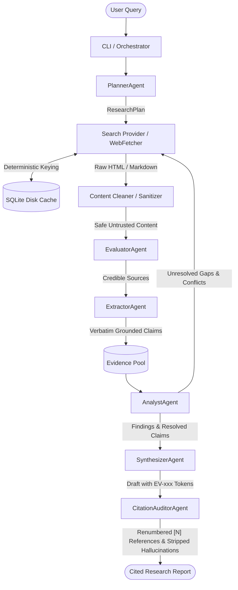

# AI Deep Research Agent

[](https://github.com/lasithadilshan/deep-research-agent/actions/workflows/ci.yml)
[](https://www.python.org/)
[](LICENSE)
[](https://github.com/astral-sh/ruff)
[](https://mypy.readthedocs.io/)
[]()

> A production-grade, extensible autonomous AI research agent system powered by **Google Gemini 3.8 Flash**, featuring strict verbatim quote grounding, automated citation audits (`[N]`), dual-provider abstractions, and circuit-breaker cost controls.

📖 **Architecture & Implementation Plan**: For the comprehensive system architecture, formal Pydantic data schemas, state progression diagrams, and milestone roadmap, see [`docs/IMPLEMENTATION_PLAN.md`](docs/IMPLEMENTATION_PLAN.md).

---

## Architectural Blueprint

The system executes deep scientific investigations through specialized autonomous agents coordinated by a centralized orchestrator:



---

## Core Pillars & Key Features

### 1. Zero-Hallucination Evidence-First Grounding
- **Verbatim Quote Enforcement**: `ExtractorAgent` extracts atomic claims from web sources only when backed by an exact uninterrupted substring quote. Any claim lacking an exact textual match in the source is instantly rejected.
- **Synthesizer Isolation**: `SynthesizerAgent` only receives structured evidence tokens (`[EV-001]`). The model is strictly forbidden from introducing ungrounded external assertions.
- **Citation Auditor Barrier**: `CitationAuditorAgent` cross-checks every token in the draft report against the evidence pool, remaps verified citations to sequential academic references (`[1]`, `[2]`), and replaces unverified claims with `[Unverified Claim]`.

### 2. Dual Provider Abstraction Layers
- **LLM Layer**: Clean `BaseLLMProvider` interface with a registry `@register_llm_provider`. Ships with native **Google Gemini 3.8 Flash** (`gemini-3.8-flash`) structured decoding, and deterministic `MockLLMProvider` for offline testing.
- **Search Layer**: Extensible `BaseSearchProvider` supporting **Tavily AI Search** (with direct markdown), **ArXiv Search API** (zero-key scientific preprint discovery), **Brave Search**, **DuckDuckGo** (zero-config fallback), and deterministic `MockSearchProvider`.

### 3. Multi-Turn Deep Iteration Engine
- **`AnalystAgent`**: Computes empirical evidence density across sub-questions, detects factual contradictions between sources, and formulates targeted follow-up search queries to resolve knowledge gaps across iterations.
- **Iterative Loop**: Runs in `QUICK` (1 turn), `STANDARD` (2 turns), or `DEEP` (up to 10 turns with early satisfaction termination).

### 4. Deterministic Caching, Web Sanitization & PDF Parsing
- **SQLite Disk Cache**: Transparent WAL-mode disk cache with configurable TTL (default 72h) for search queries and scraped web pages. Keyed by SHA-256 digests.
- **Academic PDF Parser**: Ingests scientific whitepapers and ArXiv preprints directly from `.pdf` URLs via `pypdf`, extracting page-by-page text, normalizing hyphenated breaks, and extracting document metadata.
- **SSRF Defense**: `WebFetcher` validates DNS resolutions against loopback, private, AWS metadata (`169.254.169.254`), and link-local ranges.
- **Boilerplate Stripper**: `trafilatura` extracts clean semantic article text, stripping headers, footers, ads, and navigation menus, cutting token usage by ~85%.

### 5. Session State Persistence & Multi-Format Exports
- **Session Checkpointing**: Automatic snapshot saving to `~/.deep_research/sessions/`, enabling full session resumption (`--resume <session_id>`).
- **Multi-Format Export**: Generates styled standalone **HTML** reports (with responsive dark mode and clickable reference anchors), structured **JSON**, or clean **Markdown**.

---

## Quickstart

### Installation

```bash
# Clone the repository
git clone https://github.com/lasithadilshan/deep-research-agent.git
cd deep-research-agent

# Set up virtual environment using uv or python -m venv
uv venv
source .venv/bin/activate

# Install dependencies and dev tools
uv pip install -e ".[dev]"
```

### Configuration

Copy `.env.example` to `.env` and set your API keys:

```bash
cp .env.example .env
```

```env
# Primary LLM (Google Gemini 3.8 Flash)
GEMINI_API_KEY="AIzaSyYourGeminiApiKeyHere"
GEMINI_MODEL="gemini-3.8-flash"

# Search Provider (Tavily or DuckDuckGo)
DEFAULT_SEARCH_PROVIDER="tavily"
TAVILY_API_KEY="tvly-YourTavilyKeyHere"

# Research Budget & Caching
MAX_BUDGET_USD_PER_RUN=1.00
CACHE_ENABLED=true
CACHE_EXPIRATION_HOURS=72
```

---

## Usage

### Command Line Interface

Run an interactive research session directly:

```bash
# Standard research session (2 iterations, balanced depth)
deep-research run "What is the certified efficiency of perovskite-silicon tandem solar cells?"

# Quick mode (single fast iteration)
deep-research run "Latest breakthroughs in room temperature superconductors" --mode quick

# Deep multi-turn investigation exported to Markdown file
deep-research run "Solid-state battery commercial readiness and manufacturing bottlenecks" \
  --mode deep \
  --output ./battery_report.md \
  --budget 0.50

# Academic preprint search on ArXiv (zero API key needed)
deep-research run "Fault-tolerant surface codes" --search arxiv --mode quick

# Export research report directly to standalone HTML
deep-research run "Perovskite solar cell degradation" --format html --output ./report.html

# Inspect, list, or resume saved research sessions
deep-research sessions list
deep-research sessions show ses-1234abcd
deep-research sessions export ses-1234abcd --format html -o ./exported.html
deep-research run --resume ses-1234abcd
```

> **Note**: Both `deep-research run "query"` and `deep-research "query"` are fully supported.

### Python API

```python
import asyncio
from deep_research.core.orchestrator import ResearchOrchestrator
from deep_research.models.plan import ResearchMode

async def main() -> None:
    orchestrator = ResearchOrchestrator()
    state = await orchestrator.execute_research(
        query="Compare power conversion efficiencies of tandem perovskite solar cells",
        mode=ResearchMode.STANDARD,
        max_budget_usd=0.75,
    )

    if state.final_report:
        print(state.final_report.to_markdown())

if __name__ == "__main__":
    asyncio.run(main())
```

Check out runnable scripts in the [`examples/`](examples/) directory:
- [`examples/quickstart_cli.py`](examples/quickstart_cli.py) — Minimal programmatic research run
- [`examples/custom_provider_example.py`](examples/custom_provider_example.py) — Registering a custom in-house search provider

---

## Extensibility

### Adding a Custom Search Provider

```python
from deep_research.models.search import SearchResponse, SearchResult
from deep_research.providers.search.base import BaseSearchProvider
from deep_research.providers.search.factory import register_search_provider

@register_search_provider("custom_engine")
class CustomSearchProvider(BaseSearchProvider):
    async def search(self, query: str, max_results: int = 10, **kwargs: object) -> SearchResponse:
        # Perform query against custom index or internal API
        return SearchResponse(query=query, results=[...], provider_name="custom_engine")

    def supports_direct_content(self) -> bool:
        return False
```

### Adding a Custom LLM Provider

```python
from typing import TypeVar
from pydantic import BaseModel
from deep_research.models.cost import TokenUsage
from deep_research.providers.llm.base import BaseLLMProvider
from deep_research.providers.llm.factory import register_llm_provider

T = TypeVar("T", bound=BaseModel)

@register_llm_provider("custom_llm")
class CustomLLMProvider(BaseLLMProvider):
    async def generate_text(self, prompt: str, **kwargs: object) -> tuple[str, TokenUsage]:
        ...

    async def generate_structured(self, prompt: str, response_model: type[T], **kwargs: object) -> tuple[T, TokenUsage]:
        ...

    def count_tokens(self, text: str) -> int:
        return len(text) // 4

    def calculate_cost(self, prompt_tokens: int, completion_tokens: int) -> float:
        return 0.0
```

---

## Testing & Code Quality

The codebase enforces strict type safety and high test coverage:

```bash
# Run all verification checks at once
make check

# Or individual developer commands:
make test       # Run 99+ unit and integration tests offline
make coverage   # Run tests with terminal coverage report (91%+)
make lint       # Run ruff linter
make format     # Format code with ruff
make typecheck  # Run strict mypy type check
```

---

## Contributing

We welcome community contributions! Please review [`CONTRIBUTING.md`](CONTRIBUTING.md) for code style guidelines, pull request protocols, and development workflows.

---

## License

Distributed under the **Apache 2.0 License**. See [`LICENSE`](LICENSE) for details.
